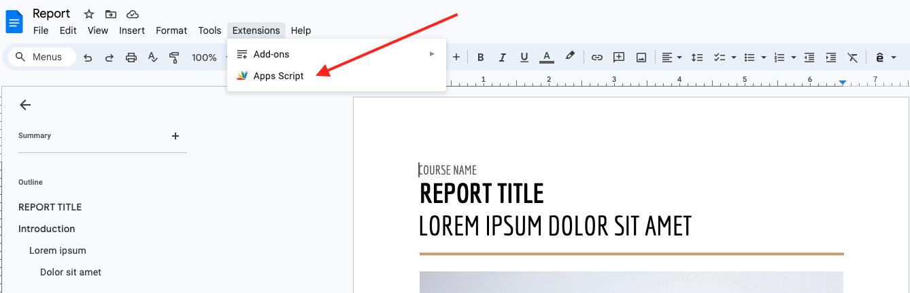
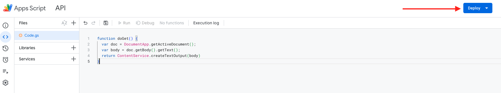
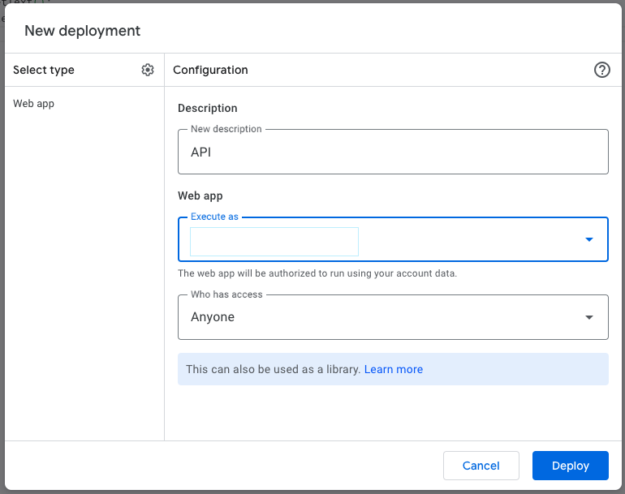
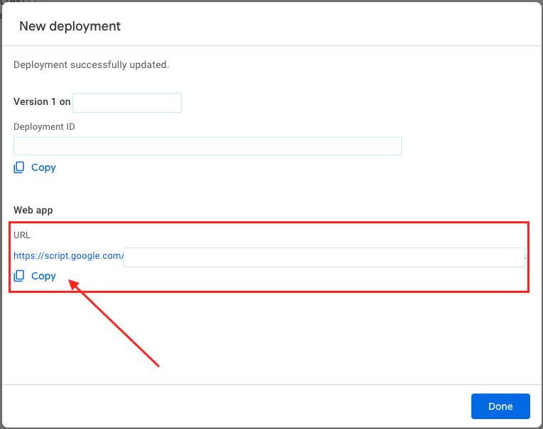
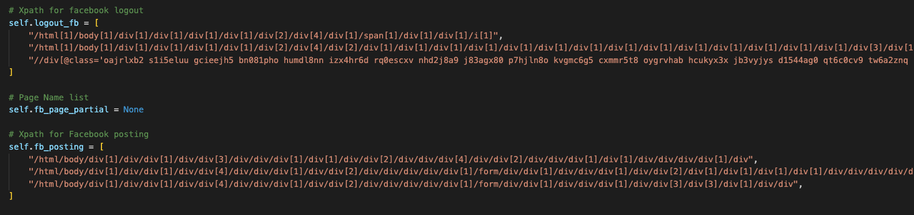

# Auto-Posting-Group-Facebook-Python
The tool will auto-get content from Google doc via API and then post this content to each page provided before

### Requirements
- python
- selenium
- webdriver_manager
- chrome

### Setup
- Set up account Facebook in file  `credentials_load.json`
  + Provide list url page facebook in field "Page Name"
  + Provide account and password in 2 fields "Email Address" and "Password"

- Set up API get content from Google doc
  + Step 1: Create new Google doc and go to `Extensions` > `Apps Script`.
  

  + Step 2: Create new function for get content from Google doc
    ```
    function doGet() {
      var doc = DocumentApp.getActiveDocument();
      var body = doc.getBody().getText();
      return ContentService.createTextOutput(body)
    }
    ```

  + Step 3: Configuration deploy this script
    
    

  + Step 4: Deploy
    

- Configuration file `fb-group-poster.py`
  + Config absolute path for: `PATH_FILE_CREDENTIALS`, `PATH_FILE_LOG`
  + Copy URL from Step 4 to `URL_GET_CONTENT`

- Setup cron job for run automatically
  + Example: 
  ```
  0 0 * * 1 clear_log.sh
  0 */4 * * * /usr/bin/python3 fb-group-poster.py
  ```
  + Cron 1 run at 00:00 on Monday. It will clear content of file `posting.log`
  + Cron 2 run at minute 0 past every 4th hour. It will post content to group Facebook

### Note:
If Facebook update tags HTML. You need go to Facebook and find XPATH of elements like: username, password, post content, button post,... and change in the code below:
